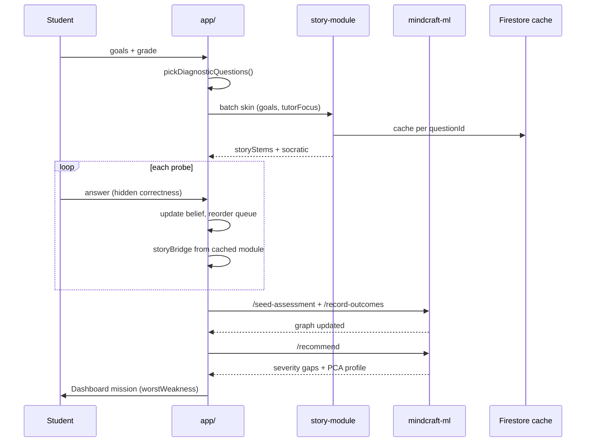

# Adaptive Story Path — Fable 5 Architecture Spec

**Scope:** Product (`app/**`) + webhook (`story-module`) + reads ML engine (`/recommend`, `/record-outcomes`)  
**Status:** Canonical design for diagnostic → personalized study path  
**Read first:** `WORLD_VISION.md`, `ml/mindcraft_graph/representation/embeddings.py`, `student_embeddings.py`, `planning/pathfinder.py`, `app/src/lib/recommendNextConcept.ts`

---

## 1. The student journey (what we're building)

```
Login → Onboard diagnostic (goals + ~10 probes, hide correctness)
    → ONE batched Groq story-module skins the probe set (goals-aware)
    → Probes update concept priors (/seed-assessment + /record-outcomes)
    → Dashboard: engine computes gaps (severity, PCA displacement)
    → Practice missions: weakness/learn paths, reshuffle until mastery threshold
    → Story-module per session (cached → enriches bank over time)
```

**Not** bulk-reskinning 1,500 bank rows. **Yes** runtime story-module + deterministic display fallback + engine math for selection.

---

## 2. Three brains (who decides what)

| Brain | Owns | LLM? |
|-------|------|------|
| **Engine** (`mindcraft-ml`) | Concept mastery, gap severity, PCA axes, pathfinder trim | No |
| **Story-module** (Groq webhook) | Narrative stem, Socratic, steps — math frozen | Yes, batched |
| **Product** (`storyDisplay.ts`) | Tables, polygons, vignettes when cache/bank stale | No |

Groq never picks *which* question comes next. Groq only skins questions the engine/product already selected.

---

## 3. PCA — how it ties in (engine, already live)

Concepts embed to 384-dim (MiniLM), reduced to **4 PCA axes** (~33% variance):

| Axis | Meaning |
|------|---------|
| PC1 | applied/geometric ↔ algebraic/symbolic |
| PC2 | probabilistic/functional ↔ trigonometric/spatial |
| PC3 | calculus ↔ statistical |
| PC4 | analytic ↔ linear-algebraic |

**Student embedding** (two centroids in `student_embeddings.py`):

- **Mastery-weighted** — where they're studying (`Σ mᵢ·eᵢ`)
- **Strength-weighted signed** — where they perform well

**Displacement** = distance between them → learning-efficiency direction (`/recommend` → `displacementMagnitude`, `displacementDirection`).

### Product use (no PCA in browser)

After diagnostic seeds the graph, `/recommend` returns `studentProfile` projections. Product uses:

1. **`topWeaknesses`** + gap **`severity`** → `worstWeakness()` (C1)
2. **Format gaps** when displacement suggests representation mismatch (bridge gap `gapType: format`)
3. **Tutor `tutorFocusConcepts`** → override weakness pick when set

Diagnostic **cannot** use PCA until ≥3 probe outcomes exist. Cold-start selection uses:

- Grade scope (`GRADE_CONCEPTS`)
- Goal tags (`act_prep` → exam concepts)
- Tutor focus (if set)
- **Maximum uncertainty** across concepts (see §4)

---

## 4. Diagnostic question selection (mathematical logic)

### 4.1 Initial probe set (N ≈ 10)

**Objective:** maximize information about concept-level mastery across grade scope while staying playable.

```
concepts ← shuffle(gradeScope ∪ goalExtras ∪ tutorFocus)
picked ← []
for c in concepts until |picked| ≥ N:
  q ← bestPlayableQuestion(c, levelsForGrade)
  if q and q.id not used: picked.append(q)

bestPlayableQuestion prefers:
  1. storyVisualScore > 0 (table/polygon/vignette — student sees rich scene)
  2. format diversity (avoid 10× symbolic_expression)
```

Implemented: `pickDiagnosticQuestions()` + `storyVisualScore()` in `diagnosticQuestions.ts`.

### 4.2 Adaptive follow-ups (during diagnostic)

After each probe, update **belief state**:

```
belief[c].correct, belief[c].total
masteryEst[c] = (correct + 1) / (total + 2)   # Beta(1,1) posterior mean
uncertainty[c] = 1 - |2·masteryEst[c] - 1| × min(1, total/2)
```

**Reshuffle rule:**

| Outcome | Action |
|---------|--------|
| Wrong on concept C | Inject 1 follow-up from C (L1 if wrong twice) before continuing spread |
| Right on C, uncertainty still high | Optional second probe on C (max 2/concept) |
| Right on C, masteryEst > 0.7 | Deprioritize C for remainder |

**Next probe index:** argmax `uncertainty[c]` among concepts with remaining budget, weighted × `tutorFocus` (×1.5) × `goalExtras` (×1.2).

Implemented: `adaptiveDiagnostic.ts` → `reorderProbeQueue()`.

### 4.3 Threshold to exit diagnostic

Default `studyPathConfig` (tutor-overridable on `users/{studentId}`):

```ts
{
  masteryExitMin: 5,      // min first-try trials (Practice)
  masteryExitAcc: 0.8,
  masteryExitStreak: 3,
  diagnosticProbeCount: 10,
  diagnosticFollowUps: true,
}
```

Diagnostic itself ends after fixed probe count + seeding; **Practice** uses threshold for session exit.

---

## 5. Gap identification (engine — post diagnostic)

```
/seed-assessment  ← confidence map (hard/kinda/easy per concept)
/record-outcomes  ← probe results (practice source)
/recommend        ← severity-ranked gaps + PCA profile
worstWeakness()   ← max playable severity across concept/format/misconception
```

**Severity** (C1): comparable across gap types, higher = worse. Plain weakness uses `1 − mastery`.

Tutor override: if `tutorFocusConcepts[0]` playable → Practice weakness mission starts there (Fable5 Area 4).

---

## 6. Groq story-module — efficient LLM budget

### 6.1 When Groq fires

| Trigger | Calls | Max questions/call |
|---------|-------|-------------------|
| Diagnostic `beginProbes()` | 1 batch | 12 |
| Practice `startSession()` | 1 batch | 12 |
| Concept chapter load | 1 batch | 12 |
| Per-answer reskin | **0** | — |

### 6.2 What Groq receives (v4 prompt)

- Concept story (from `conceptStories.json`)
- **Student goals** (`tags`, `text`) — surface context only, never change numbers
- **Tutor focus concepts** — emphasize those worlds in scene-setting
- **Prior probe outcomes** (last 3) — tone/bridge, not new math
- Per question: stem, choices, correct, explanation, hints, format, misconception

### 6.3 Caching → richer bank

```
Firestore: story_module_cache/{v4__conceptId__questionId}
TTL: 30 days
```

Cache hit = 0 tokens. Miss = 1 batched call amortized over all students.

Optional goals-variant cache: `v4g_{goalsHash}__...` only when `goals.text.length > 20` — avoids exploding cache for empty goals.

### 6.4 Story "evolution" without per-answer Groq

After each answer, **client** shows `storyBridgeLine()`:

- Wrong → `storyItem.misconceptionCallout` or socratic[1]
- Right → `storyItem.socratic[0]` or "The path opens…"

Next question's **cached `storyStem`** was already skinned with goals at batch time. Evolution = margin bridges, not re-generation.

---

## 7. Workflow diagram



---

## 8. Implementation map

| File | Role |
|------|------|
| `app/src/lib/studyPathConfig.ts` | Defaults + read tutor overrides |
| `app/src/lib/adaptiveDiagnostic.ts` | Belief + queue reshuffle |
| `app/src/lib/storyBridge.ts` | Post-answer narrative bridges |
| `app/src/lib/storyModule.ts` | Goals/tutor/outcomes in API call |
| `webhook/api/story-module.ts` | Prompt v4 + goals |
| `app/src/pages/GradeOnboard.tsx` | Adaptive diagnostic + story wire |
| `app/src/pages/Practice.tsx` | Story in gap-scan + config thresholds |
| `app/src/pages/TutorDashboard.tsx` | Set `studyPathConfig` + `tutorFocusConcepts` |

---

## 9. Test account

`akshatkoirala@gmail.com` → `resetStudentProfile` on login → `/onboard?entry=1` every time. Full diagnostic → dashboard flow testable end-to-end.

---

## 10. Acceptance

1. Diagnostic shows story stems (Groq or `storyDisplay` fallback) + correct figures
2. Goals text influences scene-setting (visible in storyContext/stem tone)
3. Wrong answer → follow-up probe on same concept (when `diagnosticFollowUps: true`)
4. After diagnostic → `/recommend` drives weakness mission
5. Practice gap-scan shows story framing, hides correctness
6. Tutor can set focus + thresholds on student doc
7. `story_module_cache` grows without re-calling Groq for same question
