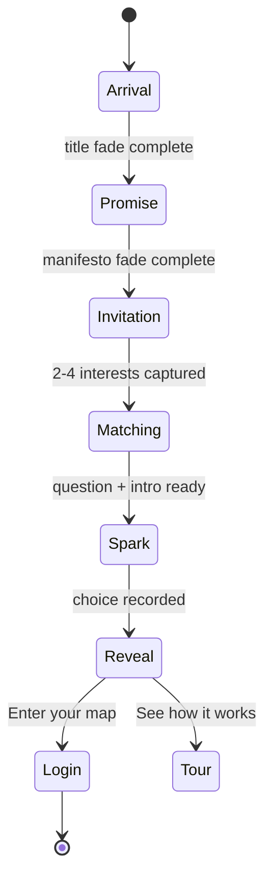

# First Spark — Cinematic Interest → Story → Question Onboarding

**Lane:** Product (`app/**` only). Engine touch: optional `/api/story-module` call (already live).  
**Route:** `/spark` (public, pre-auth) → personalized demo → `/login` or `/onboard`  
**North star:** In under 90 seconds, a stranger types what they actually care about and solves one math problem that *could only exist because they told us*. Then the full site opens like a curtain lift.

> Brand guardrails: `BRAND_BOOK.md` — no confetti, no “math is fun!”, no cartoon mascot energy.  
> This is cinematic and warm, not remedial. The bubbles are atmosphere, not gamification.

---

## 1. Emotional arc (5 beats)

| Beat | Duration | Feeling |
|------|----------|---------|
| **I — Arrival** | 0–4s | Quiet awe. One word. Breath. |
| **II — Promise** | 4–9s | Permission to be ambitious about *their* thing. Math is the side door, not the lecture. |
| **III — Invitation** | 9–25s | Playful depth. The world is listening. |
| **IV — Spark** | 25–70s | “Wait… this is *my* problem.” One honest click. |
| **V — Reveal** | 70–90s | The curtain. “This is MindCraft.” Enter the map. |

---

## 2. Scene choreography

### Scene 1 — Title card (`arrival`)

**Visual:** Full viewport `#060c09` (login dark). Subtle radial bloom center — `rgba(196, 245, 71, 0.06)` at 40% radius. No UI chrome.

**Copy (sequential, not simultaneous):**

```
MindCraft
```

- Font: `Fraunces` or `Instrument Serif` (if loaded), else `Georgia`
- Size: `clamp(3.5rem, 12vw, 7rem)`, letter-spacing `0.08em`
- Animation: `opacity 0→1` over 1.2s, hold 1.5s, `opacity 1→0` over 1.8s
- Easing: `cubic-bezier(0.16, 1, 0.3, 1)`

### Scene 2 — Manifesto lines (`promise`)

Same background. Two lines, staggered:

```
Be good at your craft.
```

(hold 1.2s, fade)

```
We'll find the math hiding inside it.
```

- Font: `Nunito Sans` / `DM Sans`, weight 300
- Size: `clamp(1.4rem, 4vw, 2.2rem)`
- Color: `rgba(255, 248, 233, 0.92)` (--login-cream)
- Second line gets a single lime underline draw: `::after` width `0→100%` over 0.6s
- Total scene: ~5s then crossfade to Scene 3

**Copy note:** User pitch was “learn maths on the side.” Brand-safe version above keeps the same intent without sounding dismissive of math.

### Scene 3 — Bubble field (`invitation`)

**Transition:** Background deepens; 40–60 soft orbs fade in over 2s.

**Bubble system (CSS + light canvas):**

| Property | Value |
|----------|-------|
| Count | 48 bubbles (desktop), 28 (mobile) |
| Size | `12px` – `120px`, power-law distribution (few large, many small) |
| Color | `rgba(196,245,71,0.08)` large / `rgba(95,183,121,0.15)` medium / `rgba(255,255,255,0.04)` small |
| Motion | Per-bubble: slow drift + sine wobble; `transform: translate3d()` only |
| Parallax | `pointermove` shifts layers ±12px (respect `prefers-reduced-motion`) |
| Depth | 3 z-layers, blur `0 / 2px / 6px` |

**Interest capture card** — eases up from `translateY(40px)` + `opacity 0` at ~2.5s into scene:

```
Tell us what you're into.

Type an interest and press Enter.
We'll build your first scene around it.
```

- Card: frosted glass `backdrop-filter: blur(20px)`, border `1px solid rgba(196,245,71,0.2)`
- Max-width `520px`, centered, sits above densest bubble cluster
- Input: single line, no label clutter; placeholder rotates examples every 4s:
  - `basketball…` → `music production…` → `cooking…` → `fashion…` → `gaming…`

**Interest chips:** Each Enter adds a pill below the input.

- Min 2 interests to continue (soft nudge at 1: “One more — we need a shape to match.”)
- Max 4 (5th rejected gently: “Four is plenty for a first scene.”)
- Pills: lime border, removable × on hover
- On 2nd+ chip: bubbles **near matching palette** pulse once (see §4)

**Continue trigger:** Auto-advance 800ms after 2nd interest OR explicit “Build my scene →” button fades in after 2 chips.

### Scene 4 — The Spark (`personalized question`)

**Transition:** Bubbles accelerate inward (1.2s “gather”), card dissolves, **story frame** materializes center screen — journal paper card (`--bg-warm` / FABLE5 tokens).

**Layout (single spread):**

```
┌─────────────────────────────────────────────┐
│  [protagonist] · [setting from matched tale] │
│                                              │
│  storyIntro (3 sentences, interest-woven)    │
│                                              │
│  ─── the problem ───                         │
│  question stem (MathText)                    │
│                                              │
│  ○ choice A    ○ choice B                    │
│  ○ choice C    ○ choice D                    │
│                                              │
│  [ scratch hint: "Pick one — no verdict yet" ]│
└─────────────────────────────────────────────┘
```

**After selection (hide correctness — C4 diagnostic rule):**

- Correct: world_feedback.correct line fades in; lime pulse on card edge once
- Incorrect: world_feedback.incorrect + one Socratic hint — **never** “wrong!”
- Either path: 2s pause → Scene 5

**No login required yet.** Store `sparkSession` in `sessionStorage`.

### Scene 5 — Curtain reveal (`website`)

Bubbles expand outward (reverse gather). Paper card scales down to thumbnail and docks top-left as a “memory” chip.

**Copy:**

```
You just solved something real.
This is MindCraft — your map starts here.
```

**CTAs:**

| Button | Action |
|--------|--------|
| **Enter your map** (primary, lime) | `/login?next=/onboard` — pass interests via `sessionStorage` |
| **See how it works** (ghost) | scroll-less mini tour: 3 panels (Notes · Solver · Map) animate in sequence |

On login complete, `GradeOnboard` reads `sparkSession.interests` + `matchedTaleId` and skips re-asking goals if already captured.

---

## 3. Visual system

Reuse login palette + FABLE5 tokens:

```css
--spark-bg:     #060c09;
--spark-cream:  #fff8e9;
--spark-lime:   #c4f547;
--spark-mint:   rgba(95, 183, 121, 0.2);
--spark-glow:   rgba(196, 245, 71, 0.12);
--spark-ease:   cubic-bezier(0.16, 1, 0.3, 1);
```

**Typography pairing:** Serif for manifesto moments, sans for UI. Never Comic Sans energy.

**Sound (optional v2):** Single soft chime on interest chip lock-in; paper rustle on card reveal. Off by default; respect mute.

**Reduced motion:** Skip bubble parallax, replace gather with simple crossfade, keep copy timing.

---

## 4. Interest → question matching (deterministic v1)

New file: `app/src/lib/sparkMatch.ts`  
Reuses: `storyMatch.ts`, `questionBank.ts`, `storyCells.json`

### 4.1 Interest lexicon (seed)

Map free-text tokens → tale themes + concept affinities:

```ts
const INTEREST_LEXICON: Record<string, { themes: string[]; concepts: string[]; keywords: string[] }> = {
  basketball: { themes: ['competition', 'teamwork', 'pattern'], concepts: ['ratios_proportions', 'linear_equations'], keywords: ['court', 'score', 'rhythm'] },
  cooking:    { themes: ['trade', 'community', 'fairness'], concepts: ['fractions_decimals', 'ratios_proportions'], keywords: ['recipe', 'share', 'portion'] },
  music:      { themes: ['rhythm', 'pattern', 'discipline'], concepts: ['fractions_decimals', 'sequences_series'], keywords: ['beat', 'tempo', 'count'] },
  fashion:    { themes: ['pattern', 'design'], concepts: ['geometric_transformations', 'ratios_proportions'], keywords: ['fabric', 'symmetry', 'measure'] },
  gaming:     { themes: ['strategy', 'cleverness'], concepts: ['basic_probability', 'linear_equations'], keywords: ['level', 'odds', 'route'] },
  soccer:     { themes: ['competition', 'teamwork'], concepts: ['ratios_proportions'], keywords: ['field', 'angle', 'pass'] },
  art:        { themes: ['pattern', 'design'], concepts: ['geometric_transformations', 'coordinate_geometry'], keywords: ['canvas', 'shape', 'line'] },
  travel:     { themes: ['journey', 'navigation'], concepts: ['coordinate_geometry', 'right_triangle_geometry'], keywords: ['map', 'bearing', 'distance'] },
  money:      { themes: ['trade', 'fairness'], concepts: ['fractions_decimals', 'linear_equations'], keywords: ['budget', 'cost', 'percent'] },
  space:      { themes: ['journey', 'discovery'], concepts: ['coordinate_geometry', 'functions_basics'], keywords: ['orbit', 'scale', 'distance'] },
  animals:    { themes: ['community', 'cleverness'], concepts: ['basic_probability', 'ratios_proportions'], keywords: ['herd', 'pack', 'count'] },
  building:   { themes: ['discipline', 'design'], concepts: ['area_volume', 'right_triangle_geometry'], keywords: ['blueprint', 'measure', 'angle'] },
}
```

Fuzzy match: tokenize interest string, score each lexicon entry by token overlap + substring, take top signals.

### 4.2 Tale selection

```ts
function matchTaleForInterests(interests: string[]): FolkTaleEntry {
  const signals = interests.flatMap(expandInterestToSignals)
  // Score all tales in mathSkinTop.json:
  //   0.4 * jaccard(signals.keywords, tale.keywords)
  // + 0.35 * theme overlap
  // + 0.25 * concept affinity union score
  return bestTale
}
```

### 4.3 Question selection

Priority order:

1. **Story Cell** in top tale's `concept_affinity[0]` with `level === 2`, `word_problem` or untagged, has `storyIntro` + `world_feedback`
2. Else **OpenStax MCQ** same concept, `storyContext` present
3. Else **Eedi** `word_problem` same concept
4. Else any **L2** question in concept pool

Prefer questions where `distractor_taxonomy.length >= 3` (diagnostic richness).

### 4.4 Interest weaving (v1 template, no LLM wait)

`app/src/lib/sparkNarrative.ts`:

```ts
function weaveIntro(
  interests: string[],
  tale: FolkTaleEntry,
  cell: Question,
): { storyIntro: string; protagonist: string; setting: string } {
  const anchor = interests[0]   // "cooking"
  const second = interests[1]   // "music"
  // Template slots into tale voice:
  // "You said you care about {anchor}. {Protagonist} is in {setting},
  //  and tonight the {anchor_noun} and the {math_hook} collide."
}
```

**v1.5 (optional, async):** Call existing `/api/story-module` with `goals: { tags: [], text: interests.join(', ') }` for one question while bubbles animate; fallback to template if >3s.

### 4.5 Bubble color react

When user adds interest chip, map interest → HSL hue bucket, set 6 nearest bubbles to `hsla(hue, 60%, 70%, 0.18)` for 2s fade back.

---

## 5. Data persistence

```ts
// sessionStorage key: mc_spark_session
interface SparkSession {
  interests: string[]
  matchedTaleId: string
  matchedConceptId: string
  questionId: string
  selectedIndex?: number
  completedAt?: string
}
```

**Firestore (post-login):** merge into `users/{uid}`:

```ts
interestTags: string[]       // max 4, from spark
sparkCompletedAt: string     // ISO
firstSparkTaleId: string
```

`GradeOnboard` goals step: if `interestTags.length >= 2`, pre-fill and show “We remembered what you told us” with edit option.

---

## 6. File plan (implementation)

| File | Purpose |
|------|---------|
| `app/src/pages/FirstSpark.tsx` | Scene state machine + orchestration |
| `app/src/pages/FirstSpark.module.css` | Full-bleed animation, bubbles, card |
| `app/src/components/spark/BubbleField.tsx` | Canvas or div-based particle field |
| `app/src/components/spark/InterestCapture.tsx` | Input + chips |
| `app/src/components/spark/SparkQuestionCard.tsx` | Paper card, choices, feedback |
| `app/src/lib/sparkMatch.ts` | Interest → tale → question |
| `app/src/lib/sparkNarrative.ts` | Template weaving |
| `app/src/App.tsx` | `<Route path="/spark" element={<FirstSpark />} />` |

**Entry points:**

- Marketing `index.html` hero CTA: “Try your first scene” → `/spark`
- Login page: subtle link below Google button
- Direct: `mindcraft-93858.web.app/spark`

---

## 7. Scene state machine



```ts
type SparkPhase =
  | 'arrival' | 'promise' | 'invitation'
  | 'matching' | 'spark' | 'reveal' | 'tour'
```

`matching` phase: max 2.5s. Show “Finding your scene…” with bubbles spiraling. If match instant (<200ms), still hold min 1.2s for drama.

---

## 8. Example walkthrough

**User types:** `cooking` → `music`

1. **Tale match:** Master Drummer (fractions/rhythm) or Anansi (food/fairness) — cooking tips Anansi, music tips Drummer; tie-break → higher `math_skin_score`
2. **Concept:** `fractions_decimals`
3. **Question:** Story Cell “Waterfowl Pond's Sinking Rung” (already has rich intro)
4. **Woven intro:**
   > You told us you love cooking and music. In the sanctuary kitchen, keeper Simon measures water for the evening stew the way a drummer counts pulses — each tenth of a meter is a beat you cannot miss.
5. **Student picks** `0.3` → feedback line about the night keeper reading the slate correctly
6. **Reveal:** “You just solved something real.” → Enter map

---

## 9. Quality bar (ship gates)

- [ ] 10-second test: stranger understands person → place → problem on Spark card
- [ ] Works with 2, 3, and 4 interests; graceful with unknown interests (falls back to `curious` tale)
- [ ] No correctness reveal on first pick (C4)
- [ ] `prefers-reduced-motion` path complete
- [ ] Mobile: input visible above keyboard; bubbles reduced to 24
- [ ] `npm run build` green
- [ ] Interest → question pairing logged in dev console for tuning

---

## 10. Phased delivery

| Phase | Scope | Time |
|-------|-------|------|
| **A** | Scenes 1–3 animation + interest capture only | 1 session |
| **B** | `sparkMatch.ts` + question card + hide-correctness | 1 session |
| **C** | Reveal + login handoff + `GradeOnboard` pre-fill | ½ session |
| **D** | Marketing CTA + optional Groq skin async | ½ session |

**Do NOT touch:** `ml/**`, `serve.py`, ontology, Firestore rules (client writes only allowed fields).

---

## 11. Why this is the hook

Most edtech asks: *What grade are you?* (verdict-shaped)

First Spark asks: *What do you actually care about?* (identity-shaped)

The math problem that follows is **evidence** that we listened — not a worksheet. That’s the click before the click: “They built this for me.” Everything after (map, diagnostic, practice) inherits that trust.

---

*Spec author: Cursor Product lane · 2026-07-09*
