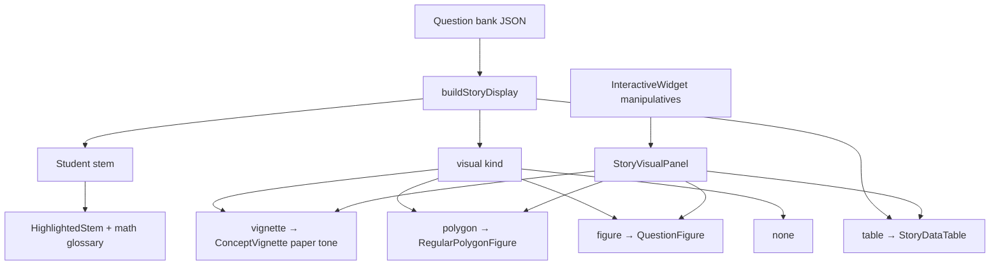

# Story Display Plan — Fable 5 × Current Architecture

**Lane:** Product (`app/**`) + Engine batch (`ml/scripts/pipeline/**`)  
**Goal:** Every bank question reads as a story scene with the right visual — not a
textbook stem plus a random coord grid.

---

## Problem (what students see today)

| Failure | Cause | Fix tier |
|---------|-------|----------|
| NWSL soccer table under Florence `storyContext` | OpenStax stem not reskinned at ingest | T1 display + T2 Groq batch |
| Coord grid on a stats table | `QuestionFigure` keyword heuristics (`table` → grid) | T1 `StoryVisualPanel` |
| Angle sketch on hexagon question | Word `angle` triggers `AngleFigure` | T1 polygon router |
| Highlights on "What is" not math terms | `extractHighlights` regex | T1 `journalGuide` |
| Eedi `storyContext` on wrong concept frame | Ingest concept mismatch | T2 targeted re-wrap |

**Key insight:** Runtime display is deterministic. Groq improves bank JSON at ingest;
the product layer must still frame stems correctly when the bank is stale.

---

## Architecture — three tiers



### Tier 1 — Product (ship first, no Groq)

**New / extended modules**

| File | Role |
|------|------|
| `app/src/lib/storyDisplay.ts` | Render-time stem reskin + visual routing |
| `app/src/lib/mathGlossary.ts` | Tap-to-define for stats/geometry terms |
| `app/src/lib/journalGuide.ts` | Math-vocabulary highlights |
| `app/src/components/StoryVisualPanel.tsx` | Unified scene: table + vignette + polygon + figure |
| `app/src/components/StoryDataTable.tsx` | Structured ward ledger (Florence reskin) |
| `app/src/components/QuestionFigure.tsx` | `RegularPolygonFigure`; skip misleading angle grid |
| `app/src/hooks/useStoryQuestion.ts` | `{ display, stemText }` hook for pages |

**Wire into**

- `GradeOnboard.tsx` — diagnostic probes (primary QA surface)
- `ConceptChapterPage.tsx` — chapter practice
- `Practice.tsx` — session question card

**Visual rules (`buildStoryDisplay`)**

1. `format === 'table'` or OpenStax `use the table` → parse columnar blob → Florence ward names → `visual: vignette` + `StoryDataTable`
2. `regular hexagon|pentagon|…` → `visual: polygon` (never `AngleFigure`)
3. Stats / word_problem without diagram alt → concept `ConceptVignette` (paper tone)
4. Real diagram alt or `format: diagram` → `QuestionFigure` only
5. Coordinate graph with equation → existing `LineGraphMini`

**Highlight rules**

- "What is the **mode**" → highlight `mode`, not `What is`
- Stats: mode, median, mean, range
- Geometry: interior angle, regular hexagon, congruent, etc.
- Tap glossary popover (Field Journal margin mentor voice)

### Tier 2 — Engine (Groq batch, user refreshes key)

Run when `LLM_PROVIDER=groq` + `GROQ_API_KEY` in `ml/.env.local`:

```bash
cd ml && source mindcraft/bin/activate
python scripts/pipeline/story_wrapper.py --bank openstax --reskin-stem
python scripts/pipeline/story_wrapper.py --bank eedi --filter mismatched
```

Outputs: `storyContext`, optional `storyStem` (math frozen, narrative wrapper), voiced hints.  
Merge into `openstaxMCQ.json` / `eediQuestions.json` via existing enrich scripts.

**Re-wrap triggers:** NWSL/National Women, `For the following exercises`, Eedi stem concept ≠ `conceptId` frame protagonist.

### Tier 3 — Later (FORMAT_WEAKNESS backlog)

- LLM-generated `Question.figure` specs (GeoGebra/Desmos)
- Per-question SVG from Layer 3 intelligence
- Full `storyStem` in bank replacing display-layer reskin

---

## Fable 5 UX contract

- **Paper interior:** vignettes use ink-on-ivory (`tone="paper"`), not dashboard dark-world white strokes
- **Scene before stem:** `storyIntro` → `storyContext` → reskinned stem → table/figure
- **One lime stroke:** primary math term only (DASHBOARD_NOTEBOOK_SPEC §5.2)
- **No misleading figures:** prefer vignette or polygon over generic grid
- **Story-first naming:** Notes | Solver | Map; protagonist from `questionContextFrames.json`

---

## Acceptance tests

1. **Florence / NWSL** (`openstax_mcq_29046_19`): ward table, bar vignette, highlight `mode`
2. **Hexagon** (`eedi_995`): regular hexagon figure, no angle grid; highlight `interior angle` or `hexagon`
3. **Diagnostic** (`GradeOnboard`): full BookShell spread unchanged; only content quality improves
4. **Practice session:** same `StoryVisualPanel` under stem
5. **Build:** `cd app && npm run build` green

---

## Ownership

| Tier | Lane | Agent |
|------|------|-------|
| T1 | Product | Cursor |
| T2 | Engine | Codex / Blake |
| T3 | Cross-cutting | Opus spec → lane split |
